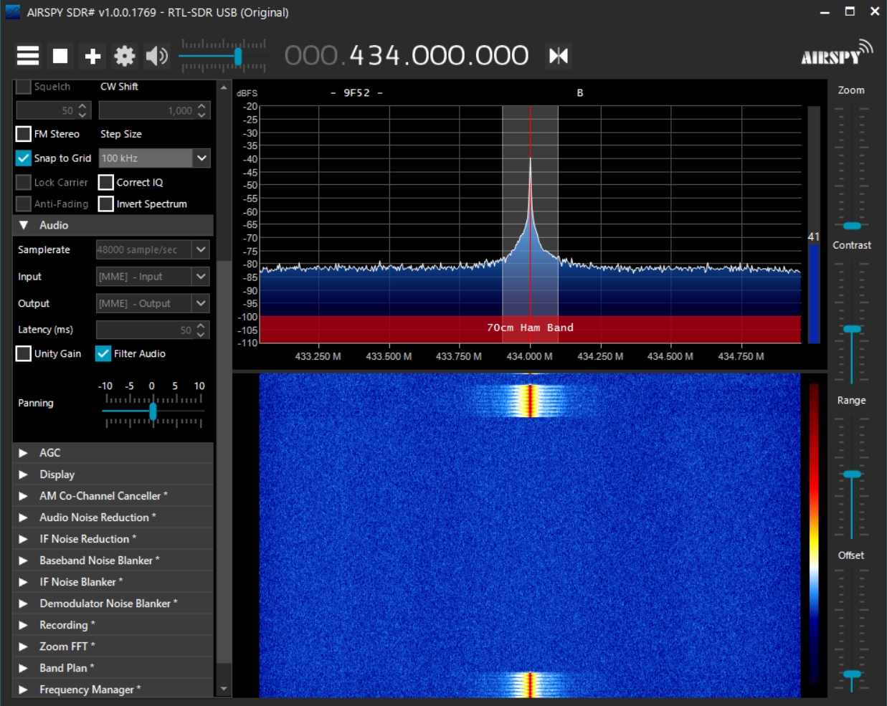

# doorbell-interceptor

This project uses a Digital TV dongle (RTL-SDR) to receive signals on 433Mhz and post alerts via MQTT.

## Background
Whilst my house isn't huge, it can be a struggle to hear the doorbell from the loft room where I've found myself working during lockdown (and beyond).  It's a bog-standard wireless variety from Volex, and I didn't fancy shelling out a fortune for a Ring, and had the technology lying around to try to pick up the signal.

I had intended to use an ESP8266 and a superheterodyne 433Mhz receiver with OpenMQTTGateway for this, but as it turned out, my doorbell doesn't quite transmit on 433.9Mhz like everyone else's, but on 434.0Mhz.

I had an RTL-SDR dongle to hand (which I used to verify the frequency) and was able to use this to pick up the signal.  More of a sledgehammer than the ESP solution but extremely flexible.

I'm using Windows here but all the below is supported on Linux.  I'm definitely standing on the shoulders of giants with the great libraries and resources that are out there.

## Requirements

- Any RTL-SDR dongle, mostly available for under $10 on Aliexpress or Banggood.
- The fantastic RTL_433 from https://github.com/merbanan/rtl_433
- Python 3.x
  - Paho MQTT Client (`pip install paho-mqtt`)
- Optional: SDR# from https://airspy.com/download/

## Discovery

### Verify the frequency
- Fire up SDR# (you may need to install the relevant drivers for the dongle with Zadig)
- Tune to around 433.9Mhz
- Send your signal

You should see something like this:



Great, you can see your doorbell signal!

You may need to tune around if you don't see it around 433.9Mhz as I did.

### Decode the signal

RTL_433 can analyse the signals being received and produce a general purpose decoder to help pinpoint that signal amongst the others.

Run `rtl_433 -A` to start analysing and press the doorbell.

This should give you an output like this:


This has recognised the signal as being pulse-width modulation, and has calculated the short and long widths of the pulses, and even given us the code we need to produce a flex-decoder!   

It also shows the binary code produced by the doorbell.

Let's check the flex decoder by running rtL_433 again with the flex decoder, so in my case:

`rtl_433 -X "n=doorbell,m=OOK_PWM,s=372,l=716,r=5356,g=684,t=136,y=0,match={13}0xad08,repeats>=3"`

You should see the signals being received with these characteristics, and nothing else - perfect!
 


## Producing MQTT packets

I ended up adapting the code from: https://github.com/mverleun/RTL433-to-mqtt

As I needed to provide a flex decoder, I ended up putting this into an array for the command and calling this in subprocess.Popen.  I also had to adapt the line that publishes the MQTT packet as it was creating duplicates, but the above code does all the heavy lifting of connecting to the MQTT broker and publishing the signal from RTL433.

## Into Node-RED...

I use Node-RED for various bits of home automation and it will happily take an MQTT packet and do something with it.  I use Telegram bots to receive updates on my phone (and send commands back).


## ...and out to Telegram

There's an awesome and comprehensive Node for Telegram at:
https://flows.nodered.org/node/node-red-contrib-telegrambot.

There's loads of docs for that so I won't go into detail here, but you'll basically need to use the Sender node and create a function to generate the message:

```javascript
msg.payload = 
    {
      chatId : YOURCHATID,
      type : 'message', 
      content: "There's someone at the door!"
    }
return msg;
```

## All done!

